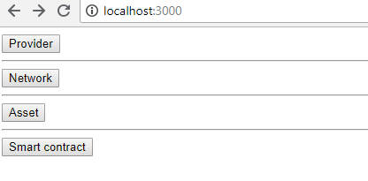
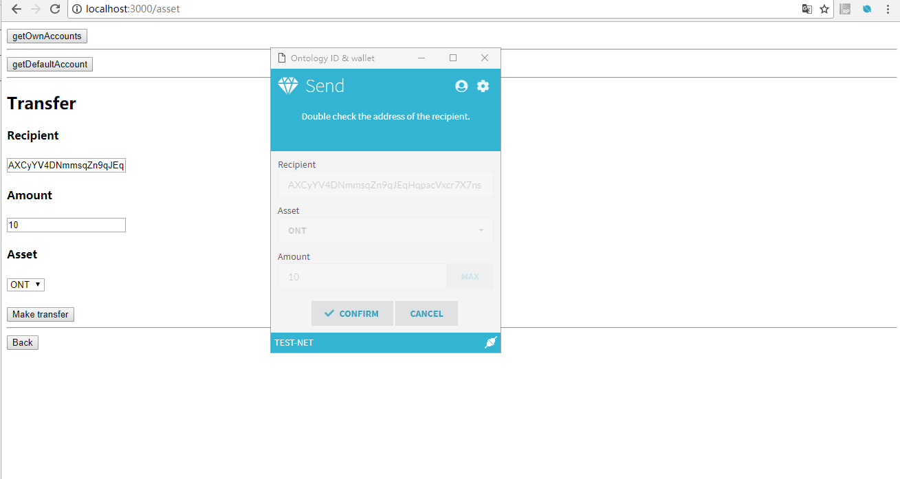

English / [中文](./ontology_dapp_dev_tutorial_zh.html)

<h1 align="center">Ontology dApp development tutorial</h1>
<p align="center" class="version">Version 1.0.0 </p>

This tutorial is designed to give you an overview of creating a dApp using the Ontology dApp API (dAPI) and including the information on the tools required and shoulds en example dApp.

The document is broken down into the following sections:

[Setting up the development environment](#setting-up-the-development-environment)

[Ontology dAPI Overview](#ontology-dapi-overview)
+ [dAPI Installation](#dapi-installation)
+ [dAPI Instantiation](#dapi-instantiation)
+ [Example dAPI methods](#example-dapi-methods)
	+ [Example blockchain methods](#example-blockchain-methods)
	+ [Example Smart Contract methods](#example-smart-contract-methods)

[Running the demo project](#running-the-demo-project)

[Writing a smart contract for your dApp](#writing-a-smart-contract-for-your-dapp)
+ [Compiling your smart contract](#compiling-your-smart-contract)
+ [Deploying your smart contract](#deploying-your-smart-contract)
+ [Testing your smart contract](#testing-your-smart-contract)


### Setting up the development environment

Please ensure you have the following installed and configured for use in your development environment.

- [Node.js v6+ LTS with npm](https://nodejs.org/en/)

- [Cyano Wallet]( https://chrome.google.com/webstore/detail/ontology-web-wallet/dkdedlpgdmmkkfjabffeganieamfklkm)

- [Git](https://git-scm.com/)


### Ontology dAPI Overview
#### dAPI Installation
The Ontology dAPI is the core API used to interface with the Ontology blockhain when creating a dApp and the repository can be found [here](https://github.com/ontio/ontology-dapi). First you must install the npm package using: 

```
$ npm install ontology-dapi
```

#### dAPI Instantiation

To use the dAPI in your project, you need to import the library and then register as a client.
Import and register the dAPI using:
```
import { client } from 'ontology-dapi';

client.registerClient({});
```

#### Example dAPI methods
Once imported and registered, use the provided dAPI methods in your dApp (see below).
##### Example blockchain methods
```
const network = await client.api.network.getNetwork();
const height = await client.api.network.getBlockHeight();
const block = await client.api.network.getBlock({ block: 1 });
const transaction = await client.api.network.getTransaction({txHash: '314e24e5bb0bd88852b2f13e673e5dcdfd53bdab909de8b9812644d6871bc05f'});
const balance = await client.api.network.getBalance({ address: 'AcyLq3tokVpkMBMLALVMWRdVJ83TTgBUwU' });
const result = await client.api.asset.makeTransfer({ recipient, asset, amount });
```

##### Example Smart Contract methods
```
const result = await client.api.smartContract.invoke({contract,method,parameters,gasPrice,gasLimit,requireIdentity});
const result = await client.api.smartContract.invokeRead({ contract, method, parameters });
const result = await client.api.smartContract.deploy({code,name,version,author,email,description,needStorage,gasPrice,gasLimit});
```

A full list of methods can be found in the [dAPI Specification document](https://github.com/backslash47/OEPs/blob/oep-dapp-api/OEP-6/OEP-6.mediawiki). <p><br> 


### Running the demo project

Clone the [dAPI demo](https://github.com/OntologyCommunityDevelopers/ontology-dapi-demo) which we will use to demonstrate functionality.

```
$ git clone https://github.com/OntologyCommunityDevelopers/ontology-dapi-demo.git

$ npm install

$ npm run start
```

This will start the demo which can be accessed using the Google Chrome browser at http://localhost:3000

Accessing this, select Provider->GetProvider.




This will allow us to communicate with the Ontology Blockchain and make API calls.  For example, selecting Network->Get Block results in the following:


You can also initiate a transfer by selecting Asset->Make Transfer where you'll be automatically prompted to approve the transaction by Cyano Wallet. Click Confirm to approve the transaction.




### Writing a smart contract for your dApp


To support your dApp you will likely want to write a smart contract that acts as the back-end logic and storage. We use Ontology's [SmartX](http://smartx.ont.io/) tool for this. SmartX includes several template Smart Contracts to assist in development and further information can be found in the [Smart Contract Tutorial](https://github.com/ontio/documentation/tree/master/smart-contract-tutorial)


#### Compiling and deploying your smart contract

SmartX uses Cyano Wallet to help with compiling, deploying and invoking the smart contract. Please make sure you have installed Cyano and created a Testnet account in it.

#### Compiling your smart contract

Use Smartx to Compile the smart contract.


#### Deploying your smart contract

Now that we have written our smart contract, the next steps are to deploy and invoke it. Deploying and Invoking requires Testnet ONG.  If you dont have any already, please [request testnet ONG in Discord](https://discordapp.com/channels/400884201773334540/453499298097922068)


 

### Testing your smart contract

In order to test the smart contract, you can use the [smart contract automated testing framework](https://github.com/lucas7788/pythontest) or deploy your own Ontology privatenet running in testmode by downloading the latest [Ontology release](https://github.com/ontio/ontology/releases) and starting it as below.
```
$ ./ontology --testmode --gasprice 0

```
