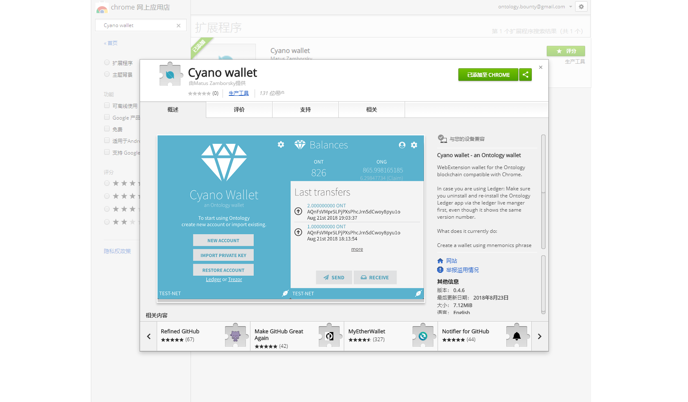

English / [中文](./ontology_dapp_dev_tutorial_zh.html)

<h1 align="center">Ontology dapp development tutorial</h1>
<p align="center" class="version">Version 1.0.0 </p>

This tutorial will take you through the process of building your first dapp.

This tutorial is meant for those with a basic knowledge of Ontology and smart contracts, who have some knowledge of HTML and JavaScript, but who are new to dapps.

In this tutorial we will be covering:

1. Setting up the development environment

2. Creating a project

3. Writing the smart contract

4. Compiling and deploy/invoke the smart contract

5. Testing the smart contract

7. Interacting with the dapp in a browser


## 1. Setting up the development environment

* [Node.js v6+ LTS and npm](https://nodejs.org/en/)

* [Git](https://git-scm.com/)


## 2. Creating a project

Download dapi package and to use [dAPI](https://github.com/ontio/ontology-dapi)

```
npm i ontology-dapi
```

You also can run demo: [DAPP Demo](https://github.com/OntologyCommunityDevelopers/ontology-dapi-demo)

This will build the project and start web server.:

```
git clone https://github.com/OntologyCommunityDevelopers/ontology-dapi-demo.git

npm install

npm run start
```

You will get the demo served at http://localhost:3000

## 3. Writing the smart contract


We'll start our dapp by writing the smart contract that acts as the back-end logic and storage.


[smartx](http://smartx.ont.io/)


## 4. Compiling and deploy/invoke the smart contract

SmartX uses Cyano Wallet to help with deploying and invoking the smart contract.Please make sure you have installed the Chrome extension - Cyano wallet and created the account in it.

### 4.1 Compiling smart contract

Use Smartx to Compiling smart contract.


### 4.2 Deploy/invoke smart contract

Now that we have written our smart contract, the next steps are to compile and deploy it. Request testnet ONG in Discard if you not have.

[Request testnet ONG in Discord](https://discordapp.com/channels/400884201773334540/453499298097922068)

Deploy smart contract with SmartX


Invoke smart contract with SmartX


## 5. Testing the smart contract

Smart contract automated testing framework.[Testing framework](https://github.com/lucas7788/pythontest)

if you want run private chain,download Ontology and run node in testmode. [Ontology](https://github.com/ontio/ontology/releases)

```
./ontology --testmode --gasprice 0

```


## 6. Interacting with the dapp in a browser

Now we're ready to use our dapp!

### Installing and configuring Cyano Wallet




The easiest way to interact with our dapp in a browser is through Cyano Wallet, a browser extension for Chrome.[Cyano Wallet](https://github.com/OntologyCommunityDevelopers/cyano-wallet)


## 7. Using the dapp


### 7.1 Start the local web server of demo:

```
npm run start

```

The dev server will launch and automatically open a new browser tab containing your dapp.


### 7.2 transfer or invoke smartcontract

To use the dapp, click the ```make``` button.

### 7.3 approve the transaction on Cyano Wallet

You'll be automatically prompted to approve the transaction by Cyano Wallet. Click Confirm to approve the transaction.


### 7.4 check transaction

In Cyano Wallet, you'll see the transaction listed: